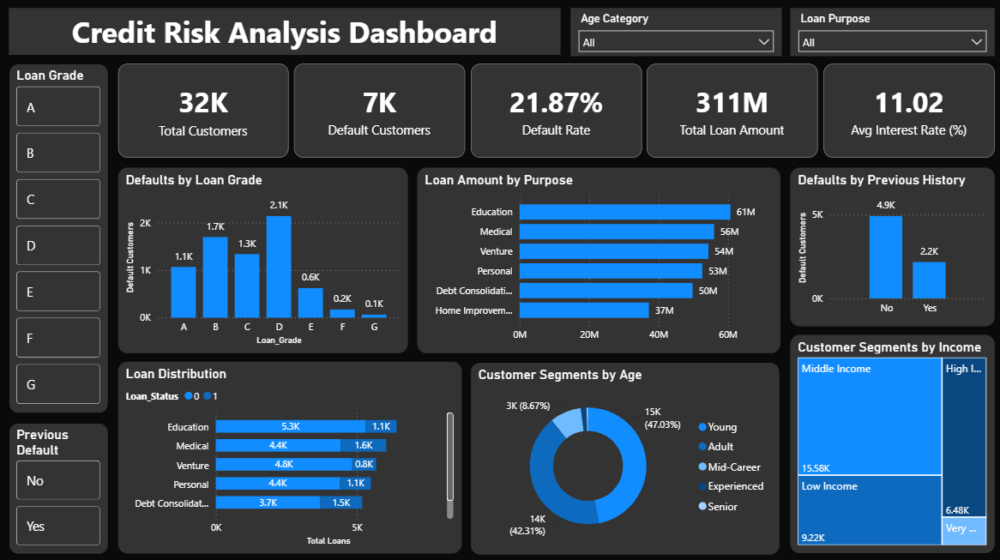

#  Banking Credit Risk Analytics

### End-to-End Data Analytics Project using Python, MySQL & Power BI

A data analytics project analyzing **32,000+ loan records** to identify default patterns, understand credit risk factors, and generate business insights using **Python (Pandas), MySQL, and Power BI**.

---

##  Project Overview

Loan defaults are a major risk for financial institutions. Understanding customer characteristics, loan attributes, income levels, employment history, credit history, and debt burden can help banks identify potential credit-risk patterns.

This project analyzes loan data to answer key business questions:

* Who are the customers most associated with loan defaults?
* Which loan grades show higher default volumes?
* How does debt burden relate to default behavior?
* Which loan purposes have higher loan exposure?
* How do income, age, employment, and credit history vary across customers?
* What factors should banks consider when assessing credit risk?

The analysis combines **Python for data cleaning and feature engineering, SQL for analytical queries, and Power BI for interactive visualization.**

---

##  Business Objectives

1. Analyze customer and loan characteristics.
2. Calculate overall loan default rate.
3. Identify default patterns across loan grades.
4. Analyze default behavior by customer segments.
5. Understand the relationship between income and loan exposure.
6. Analyze debt burden and interest-rate patterns.
7. Create business-ready customer and loan risk segments.
8. Build an interactive Power BI dashboard for decision-making.

---

##  Dataset

The project contains **32,000+ loan records after data cleaning**.

### Key Features

| Feature              | Description                            |
| -------------------- | -------------------------------------- |
| Age                  | Customer age                           |
| Income               | Annual customer income                 |
| Home Ownership       | Customer home ownership status         |
| Employment Years     | Years of employment                    |
| Loan Purpose         | Purpose of the loan                    |
| Loan Grade           | Credit/loan grade                      |
| Loan Amount          | Loan amount issued                     |
| Interest Rate        | Interest rate associated with the loan |
| Loan Status          | Loan repayment/default status          |
| Loan-to-Income Ratio | Loan amount relative to income         |
| Previous Default     | Previous default history               |
| Credit History Years | Length of credit history               |

---

##  Data Preparation

The data preparation process was performed using **Python and Pandas**.

### Steps Performed

1. Loaded the raw dataset.
2. Checked dataset shape and data types.
3. Checked missing values.
4. Checked duplicate records.
5. Renamed columns for readability.
6. Removed invalid records.
7. Removed records where age was greater than 100.
8. Removed records where employment years exceeded age.
9. Filled missing employment years using median imputation.
10. Filled missing interest rates using loan-grade-wise median imputation.
11. Created business-oriented categorical features.
12. Performed exploratory data analysis.
13. Exported cleaned and final datasets to CSV.
14. Loaded the final dataset into MySQL.

---

##  Feature Engineering

Seven business-oriented features were created using `pd.cut()`.

| Engineered Feature        | Categories                                                                           |
| ------------------------- | ------------------------------------------------------------------------------------ |
| `Age_Category`            | Young / Adult / Mid-Career / Experienced / Senior                                    |
| `Income_Category`         | Low Income / Middle Income / High Income / Very High Income                          |
| `Employment_Category`     | New Employee / Early Career / Mid Career / Experienced                               |
| `Credit_History_Category` | New Credit User / Moderate Credit History / Established Credit / Long Credit History |
| `Loan_Size_Category`      | Small Loan / Medium Loan / Large Loan / Very Large Loan                              |
| `Debt_Burden`             | Low Burden / Moderate Burden / High Burden / Very High Burden                        |
| `Interest_Rate_Category`  | Low Interest / Moderate Interest / High Interest / Very High Interest                |

---

##  Project Workflow

```text
Raw Dataset
     ↓
Python / Pandas
     ↓
Data Cleaning
     ↓
Missing Value Treatment
     ↓
Feature Engineering
     ↓
Exploratory Data Analysis
     ↓
Final Dataset
     ↓
MySQL
     ↓
SQL Analysis
     ↓
Power BI
     ↓
Interactive Dashboard
     ↓
Business Insights
```

---

##  Tech Stack

### Python

* Pandas
* NumPy
* Matplotlib

Used for:

* Data cleaning
* Data validation
* Missing-value treatment
* Feature engineering
* Exploratory data analysis
* Dataset preparation

### MySQL

Used for:

* Data analysis
* Aggregations
* Filtering
* Grouping
* CTEs
* Window functions
* Business KPI calculations

### Power BI

Used for:

* Interactive dashboard
* KPI cards
* Customer segmentation
* Default analysis
* Loan-grade analysis
* Loan-purpose analysis
* Risk analysis

---

##  Power BI Dashboard

The Power BI dashboard provides an interactive view of loan portfolio performance and credit-risk patterns.

### Dashboard Preview




---

##  Key KPIs

| KPI                           |     Value |
| ----------------------------- | --------: |
| Total Customers               |      32K+ |
| Default Customers             |       7K+ |
| Default Rate                  |    21.87% |
| Average Interest Rate         |    11.02% |
| Highest Default Grade         |   Grade D |
| Highest Loan-Purpose Exposure | Education |

---

##  Key Findings

### 1. Overall Default Rate

Approximately **7K customers defaulted out of 32K+ customers**, resulting in an overall default rate of approximately **21.87%**.

### 2. Loan Grade Risk

**Grade D** loans recorded the highest number of defaults, with more than **2,100 defaults** in the analyzed dataset.

### 3. Loan Purpose

**Education loans** represented the highest total loan amount, with approximately **61M** in loan exposure.

### 4. Previous Default History

Customers without a previous default history still represented more than **4,900 defaults**. This indicates that previous default history alone does not explain all observed defaults.

### 5. Age Distribution

Customers between **25–35 years** represented the largest age group, accounting for approximately **47%** of customers.

### 6. Interest Rate

The average interest rate across the analyzed loans was approximately **11.02%**.

---

##  SQL Analysis

The project includes SQL queries covering both basic and advanced analytical concepts.

| SQL Analysis                 | Business Purpose                  |
| ---------------------------- | --------------------------------- |
| Total Customers              | Overall customer volume           |
| Default Customers Count      | Measure default volume            |
| Default Rate %               | Calculate core risk KPI           |
| Defaults by Loan Grade       | Identify grade-level patterns     |
| Customers by Age Category    | Understand customer distribution  |
| Customers by Income Category | Analyze income segments           |
| Loan Distribution by Purpose | Understand loan demand            |
| Defaults by Previous History | Analyze previous default behavior |
| Ranking Loan Grades          | Rank grades by defaults           |
| Ranking Loan Purposes        | Rank purposes by loan amount      |
| CTE — High Risk Grades       | Identify higher-risk segments     |

SQL concepts demonstrated:

```text
SELECT
WHERE
GROUP BY
HAVING
ORDER BY
CASE
Aggregate Functions
CTE
RANK()
DENSE_RANK()
Window Functions
```

---

##  Project Structure

```text
Banking-Credit-Risk-Analytics/
│
├── data/
│   ├── raw_data.csv
│   ├── cleaned_data.csv
│   └── final_data.csv
│
├── notebooks/
│   └── analysis.ipynb
│
├── sql/
│   └── credit_risk_analysis.sql
│
├── powerbi/
│   └── Banking_Credit_Risk_Analytics.pbix
│
├── dashboard/
│   └── banking_credit_risk_dashboard.png
│
├── README.md
└── .gitignore
```

---

##  Skills Demonstrated

This project demonstrates practical Data Analyst skills including:

* Data Cleaning
* Data Validation
* Exploratory Data Analysis
* Missing Value Treatment
* Feature Engineering
* Business Segmentation
* SQL Analysis
* CTEs
* Window Functions
* KPI Development
* Power BI Dashboard Development
* Business Insight Generation
* End-to-End Data Analytics Workflow

---

##  Business Value

The analysis provides a structured view of customer and loan characteristics associated with observed default patterns.

The insights can support analytical use cases such as:

* Credit-risk monitoring
* Customer segmentation
* Loan portfolio analysis
* Risk reporting
* Default trend analysis
* Management dashboards
* Data-driven lending analysis

---

##  Project Summary

**Domain:** Banking / Financial Services
**Project:** Loan & Credit Risk Analytics
**Data:** 32,000+ loan records
**Python:** Pandas, NumPy, Matplotlib
**Database:** MySQL
**Visualization:** Power BI
**Repository:** GitHub

---

##  Author

**Shashikant Ghule**

Data Analyst | Python | SQL | Power BI
